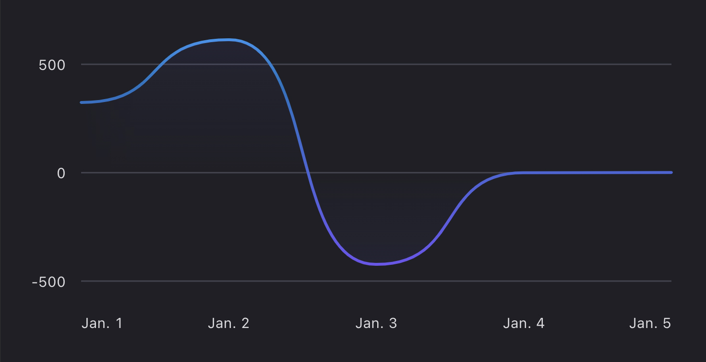
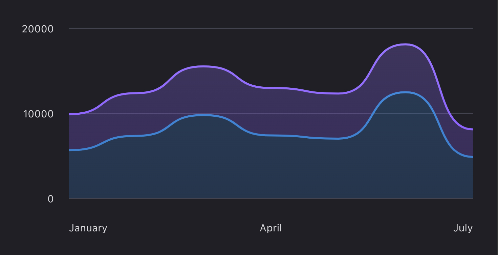
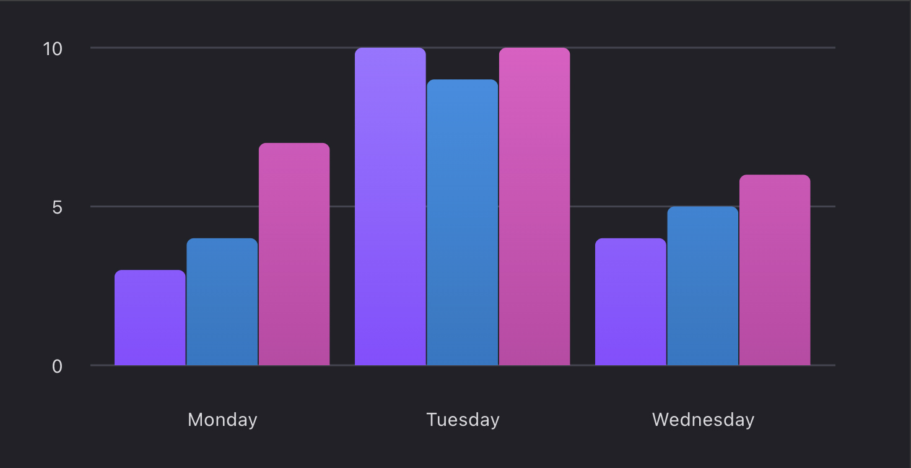
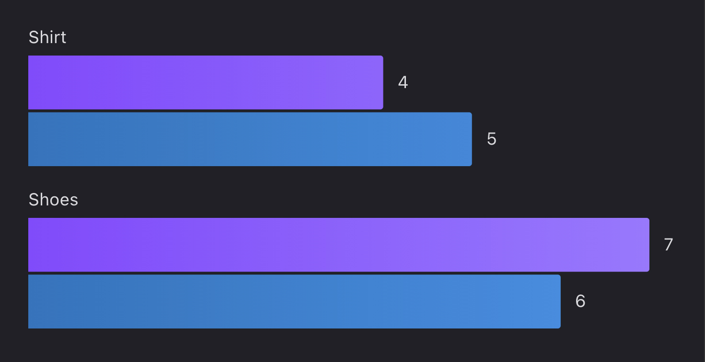
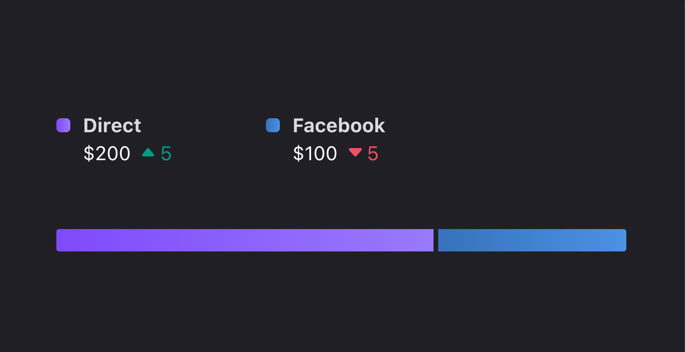
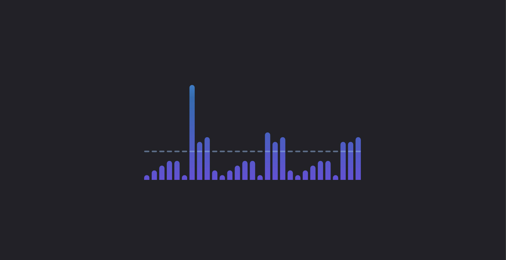
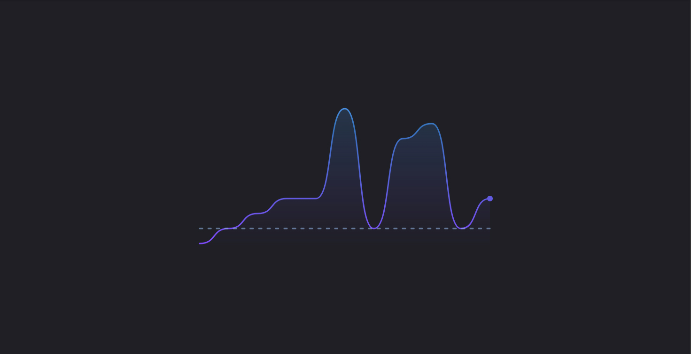

<br/>
<br/>
<br/>
<br/>
<br/>
<a name="polaris-viz" href="#polaris-viz">
  
</a><br/><br/>
Polaris Viz is a data visualization React component library. It was built to help Shopify merchants better understand their data.

<br/>
<br/>
<br/>
<br/>
<br/>
<br/>
<a name="installation" href="#installation">
  <h3>Installation</h3>
</a>

Run the following command using [npm](https://www.npmjs.com/):

```bash
npm install @shopify/polaris-viz --save
```

If you prefer [Yarn](https://yarnpkg.com/en/), use the following command instead:

```bash
yarn add @shopify/polaris-viz
```

#### Peer dependencies

Polaris Viz has peer dependencies on:

- `react@^16.8.6 || ^17.0.0`
- `react-dom@^16.8.6 || ^17.0.0`
- `@juggle/resize-observer@^3.3.1`

You are responsible for providing these packages in your project. By requiring these packages as `peerDependencies` we can be sure there won't be duplicate packages included due to version mismatches.


#### Available commands

| Command                         | What it's used for                                                  |
| ------------------------------- | ---------------------------------------------------------------- |
| `dev up`                        | Project set up                                                   |
| `dev storybook`                 | Start a server running [Storybook](https://storybook.js.org/)    |
| `dev add-story [ComponentName]` | Create boilerplate files to include a new component in Storybook |
| `dev add-story [ComponentName] --no-comments` | Create boilerplate files to include a new component in Storybook without comments |

<br/>
<br/>
<br/>
<br/>
<a name="usage" href="#usage">
  <h3>Usage</h3>
</a>

If your app is set up to consume `esnext` builds, import components where you want to use them and the styles will automatically be applied.

If your app is not set up for `esnext`, import the styles where you import components from the library:

```js
import '@shopify/polaris-viz/styles.css';
```

<br/>
<br/>
<br/>
<br/>
<a name="components" href="#components">
  <h3>Components</h3>
</a>

Chart components inherit their sizes from their containers, so place your chart components inside an element with a width and height specified.

<br/>

<table>
  <tr>

  <td width="50%">
<a href="https://polaris-viz.shopify.io/?path=/docs/charts-linechart">
  
</a>

#### LineChart

Used to show change over time, comparisons, and trends. [View documentation&nbsp;→](https://polaris-viz.shopify.io/?path=/docs/charts-linechart)

  </td>

  <td width="50%">
<a href="https://polaris-viz.shopify.io/?path=/docs/charts-stackedareachart">
  
</a>

#### StackedAreaChart

Used to compare multiple series of data and display the total value. [View documentation&nbsp;→](https://polaris-viz.shopify.io/?path=/docs/charts-stackedareachart)

  </td>


  </tr>

   <tr>

  <td width="50%">
<a href="https://polaris-viz.shopify.io/?path=/docs/charts-bar-chart">
  
</a>

#### BarChart

Used to show a grouped comparison of different types, across categories or time. [View documentation&nbsp;→](https://polaris-viz.shopify.io/?path=/docs/charts-bar-chart)

  </td>

  <td width="50%">
<a href="https://polaris-viz.shopify.io/?path=/docs/subcomponents-tooltipcontent">
  
</a>

#### Tooltip content

Used to format content in tooltips. Alternatively, use a custom tooltip. [View documentation&nbsp;→](https://polaris-viz.shopify.io/?path=/docs/subcomponents-tooltipcontent)

  </td>
  </tr>


  <tr>


  <td width="50%">
<a href="https://polaris-viz.shopify.io/?path=/docs/subcomponents-legend">
  
</a>

#### Legend

Used on multiseries charts to indicate which color is associated with a certain series. [View documentation&nbsp;→](https://polaris-viz.shopify.io/?path=/docs/subcomponents-legend)

  </td>
  </tr>

</table>

<br />

<a name="simple-charts" href="#simple-charts">
  <h4>Simple Charts</h4>
</a>

<table>
  <tr>
    <td width="50%">

<a href="https://polaris-viz.shopify.io/?path=/docs/simple-charts-simplenormalizedchart--default">
  
</a>

#### SimpleBarChart

Used to show comparison across categories. [View documentation&nbsp;→](https://polaris-viz.shopify.io/?path=/docs/simple-charts-simplebarchart--default)

  </td>
    <td width="50%">

<a href="https://polaris-viz.shopify.io/?path=/docs/simple-charts-simplenormalizedchart--default">
  
</a>

#### SimpleNormalizedChart

Used for positive datasets with two to four items. [View documentation&nbsp;→](https://polaris-viz.shopify.io/?path=/docs/simple-charts-simplenormalizedchart--default)

  </td>
  </tr>
</table>

<br />

<a name="spark-charts" href="#spark-charts">
  <h4>Spark Charts</h4>
</a>

<table>
  <tr>
    <td width="50%">

<a href="https://polaris-viz.shopify.io/?path=/docs/spark-charts-sparkbarchart--default">
  
</a>

#### SparkBarChart

Used in small sizes to show how a metric has performed over time with bars. [View documentation&nbsp;→](https://polaris-viz.shopify.io/?path=/docs/spark-charts-sparkbarchart--default)

  </td>
    <td width="50%">

<a href="https://polaris-viz.shopify.io/?path=/docs/spark-charts-sparklinechart--default">
  
</a>

#### SparkLineChart

Used in small sizes to show how a metric has performed over time. [View documentation&nbsp;→](https://polaris-viz.shopify.io/?path=/docs/spark-charts-sparklinechart--default)

  </td>

  </tr>
</table>

<br/>
<br/>
<br/>
<br/>
<a name="contributing" href="#contributing">
  <h3>Contributing</h3>
</a>

Pull requests are welcome. See the <a href="/CONTRIBUTING.md">contribution guidelines</a> for more information.

<br/>
<br/>
<br/>
<br/>
<a name="licenses" href="#licenses">
  <h3>Licenses</h3>
</a>

- Source code is under a [custom license](https://github.com/Shopify/polaris-viz/blob/master/LICENSE.md) based on MIT. The license restricts Polaris Viz usage to applications that integrate or interoperate with Shopify software or services, with additional restrictions for external, stand-alone applications.
