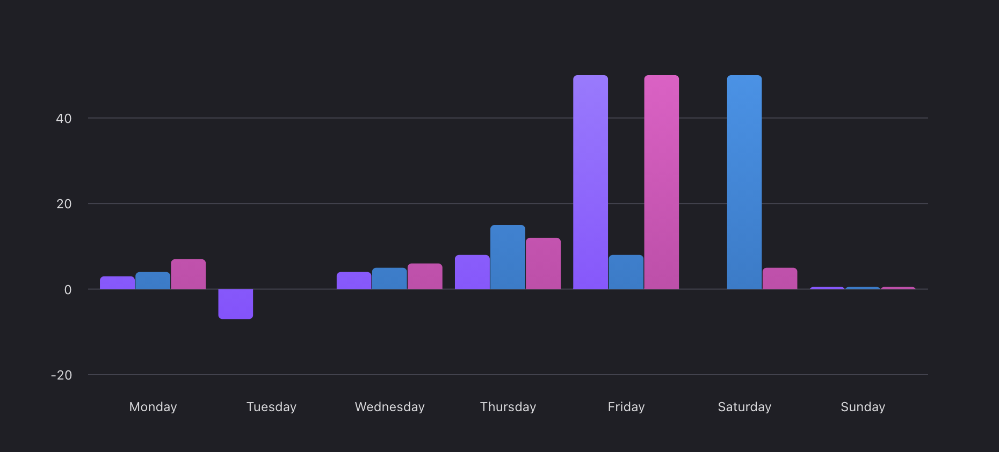
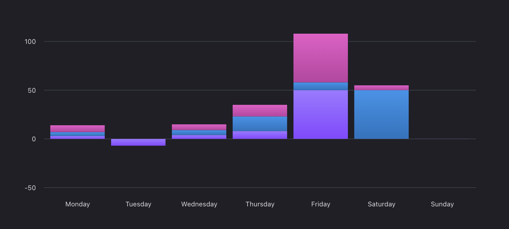

<br/>
<br/>
<br/>
<br/>
<br/>
<a name="polaris-viz" href="#polaris-viz">
  
</a><br/>
Polaris Viz is a data visualization React component library. It was built to help Shopify merchants better understand their data.

<br/>
<br/>
<br/>
<br/>
<br/>
<br/>
<a name="installation" href="#installation">
  
</a>

Run the following command using [npm](https://www.npmjs.com/):

```bash
npm install @shopify/polaris-viz --save
```

If you prefer [Yarn](https://yarnpkg.com/en/), use the following command instead:

```bash
yarn add @shopify/polaris-viz
```


#### Available commands

| Command                         | What's used for                                                  |
| ------------------------------- | ---------------------------------------------------------------- |
| `dev up`                        | Project set up                                                   |
| `dev s`                         | Start a server running `Playground.tsx`                          |
| `dev storybook`                 | Start a server running [Storybook](https://storybook.js.org/)    |
| `dev add-story [ComponentName]` | Create boilerplate files to include a new component in Storybook |
| `dev add-story [ComponentName] --no-comments` | Create boilerplate files to include a new component in Storybook without comments |

<br/>
<br/>
<br/>
<br/>
<a name="usage" href="#usage">
  
</a>

If your app is set up to consume `esnext` builds, import components where you want to use them and the styles will automatically be applied.

If your app is not set up for `esnext`, import the styles where you import components from the library:

```js
import '@shopify/polaris-viz/styles.css';
```

<br/>
<br/>
<br/>
<br/>
<a name="components" href="#components">
  
</a>

Chart components inherit their sizes from their containers, so place your chart components inside an element with a width and height specified.

<br/>

<table>
  <tr>
  <td>

<a href="../src/components/NormalizedStackedBarChart/NormalizedStackedBarChart.md">
  
</a>

#### Normalized stacked bar chart

Used for positive datasets with two to four items. [View documentation&nbsp;→](../src/components/NormalizedStackedBarChart/NormalizedStackedBarChart.md)

  </td>
  <td>

<a href="../src/components/Sparkline/Sparkline.md">
  
</a>

#### Sparkline

Used in small sizes to give an overview of how a metric has performed over time. [View documentation&nbsp;→](../src/components/Sparkline/Sparkline.md)

  </td>
  </tr>

  <tr>

  <td>

<a href="../src/components/Sparkbar/Sparkbar.md">
  
</a>

#### Sparkbar

Used in small sizes to give an overview of how a metric has performed over time with bars. [View documentation&nbsp;→](../src/components/Sparkbar/Sparkbar.md)

  </td>

  <td>
<a href="../src/components/LineChart/LineChart.md">
  
</a>

#### Line chart

Used to show change over time, comparisons, and trends. [View documentation&nbsp;→](../src/components/LineChart/LineChart.md)

  </td>

  </tr>
  <tr>

  <td>

<a href="../src/components/BarChart/BarChart.md">
  
</a>

#### Bar chart

Used to show comparison across categories. [View documentation&nbsp;→](../src/components/BarChart/BarChart.md)

  </td>

  <td>
<a href="../src/components/MultiSeriesBarChart/MultiSeriesBarChart.md">
  
</a>

#### Multi-series grouped bar chart

Used to show a grouped comparison of different types, across categories. [View documentation&nbsp;→](../src/components/MultiSeriesBarChart/MultiSeriesBarChart.md)

  </td>

  <tr>

  <td>
<a href="../src/components/MultiSeriesBarChart/MultiSeriesBarChart.md">
  
</a>

#### Multi-series stacked bar chart

Used to show a stacked comparison of different types, across categories. [View documentation&nbsp;→](../src/components/MultiSeriesBarChart/MultiSeriesBarChart.md)

  </td>

  <td>
<a href="../src/components/StackedAreaChart/StackedAreaChart.md">
  
</a>

#### Stacked area chart

Used to compare multiple series of data and display the total value. [View documentation&nbsp;→](../src/components/StackedAreaChart/StackedAreaChart.md)

  </td>

  </tr>

<tr>
  <td>
<a href="../src/components/TooltipContent/TooltipContent.md">
  
</a>

#### Tooltip content

Used to format content in tooltips. [View documentation&nbsp;→](../src/components/TooltipContent/TooltipContent.md)

  </td>

  <td>
<a href="../src/components/Legend/Legend.md">
  
</a>

#### Legend

Used on multiseries charts to indicate which color is associated with a certain series. [View documentation&nbsp;→](../src/components/Legend/Legend.md)

  </td>
  <td></td>
  </tr>

</table>

<br/>
<br/>
<br/>
<br/>
<a name="contributing" href="#contributing">
  
</a>

Pull requests are welcome. See the <a href="/CONTRIBUTING.md">contribution guidelines</a> for more information.

<br/>
<br/>
<br/>
<br/>
<a name="licenses" href="#licenses">
  
</a>

- Source code is under a [custom license](https://github.com/Shopify/polaris-viz/blob/master/LICENSE.md) based on MIT. The license restricts Polaris Viz usage to applications that integrate or interoperate with Shopify software or services, with additional restrictions for external, stand-alone applications.
