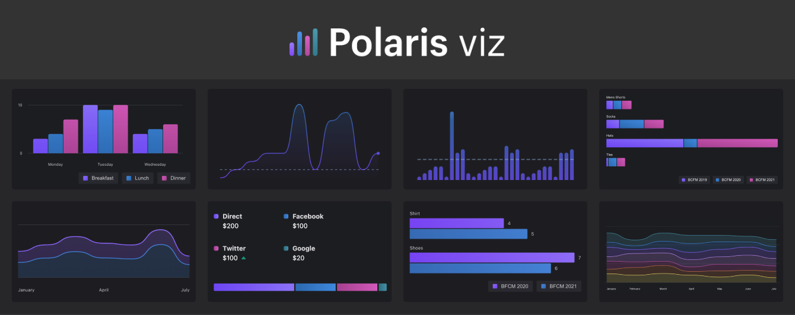

# Deprecation Notice

**This package is now deprecated**

We have decided to decommission the `polaris-viz` package due to the lack of external use and cost to support. For Shopifolk, we will be moving to an internal-only data viz library.

If you have any questions or require assistance during your transition, feel free to reach out to [Shopify support](https://help.shopify.com/support).

Thank you for your understanding!

  

**Polaris Viz** is Shopify's data visualization system. It's what powers many of our data heavy experiences, including [ShopifyQL Notebooks](https://shopify.engineering/shopify-commerce-data-querying-language-shopifyql).

It is composed of two consumer-facing libraries:

 

-  `polaris-viz`

 a collection of React components built for **web**

 

- `polaris-viz-native`

  a collection of React Native components optimized for **mobile experiences**

 

Both libraries use the same [Data Structure](https://polaris-viz.shopify.com/?path=/docs/shared-data-structure--page), [Utility functions](https://polaris-viz.shopify.com/?path=/docs/shared-utilities-accessibility-color-vision-events--page), [Themes](https://polaris-viz.shopify.com/?path=/docs/shared-themes-default-themes--page) and SubComponents. _All things shared_ between `@shopify/polaris-viz` and `@shopify/polaris-viz-native` are documented in the Storybook's `Shared` folder

- [📓 Docs & Examples](https://polaris-viz.shopify.com/)
- [🖥 Getting Started with Polaris Viz](https://polaris-viz.shopify.com/?path=/docs/polaris-viz-getting-started--page)
- [📱 Getting Started with Polaris Viz **Native**](https://polaris-viz.shopify.com/?path=/docs/polaris-viz-native-getting-started--page)

 

 

Our libraries are structured to favor charts that prioritize accessibility and motion design. The goal is to help users create clear and meaningful analytics experiences.

We want to do the heavy lifting of developing charts, so our partners can focus on telling amazing data stories and not re-inventing the wheel.

 

 

<a name="contributing" href="#contributing">
  <h3>🤝 Contributing</h3>
</a>

Want to help us build the future of data viz?
The system is currently in active development and we are working on expanding its features and available charts.

Pull requests are welcome! See the [contribution docs](https://github.com/Shopify/polaris-viz/blob/master/CONTRIBUTING.md) for more information and to learn how to set up your development environment.

 

 
<a name="licenses" href="#licenses">
  <h3>📃 Licenses</h3>
</a>

 Source code is under a [custom license](https://github.com/Shopify/polaris-viz/blob/main/LICENSE.md) based on MIT. The license restricts Polaris Viz usage to applications that integrate or interoperate with Shopify software or services, with additional restrictions for external, stand-alone applications.
