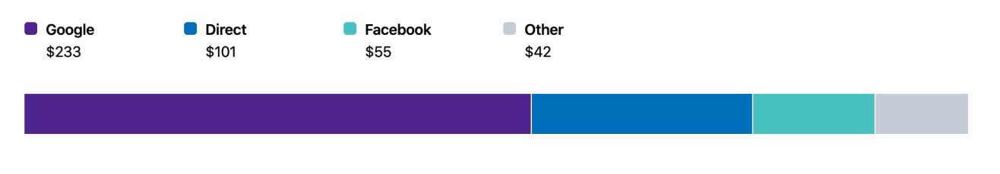

# Polaris Viz

Polaris Viz is a data visualization React component library. It was built to help Shopify merchants better understand their data.

## Installation

Run the following command using [npm](https://www.npmjs.com/):

```bash
npm install @shopify/polaris-viz --save
```

If you prefer [Yarn](https://yarnpkg.com/en/), use the following command instead:

```bash
yarn add @shopify/polaris-viz
```

## Usage

If your app is set up to consume `esnext` builds, import components where you want to use them and the styles will automatically be applied.

If your app is not set up for `esnext`, import the styles where you import components from the libary:

```js
import '@shopify/polaris-viz/styles.css';
```

## Components

<table>
  <thead>
    <th>Viz</th>
    <th>Use cases</th>
    <th>Props</th>
  <thead>
  <tbody>
  <tr>
    <td>
      Normalized stacked bar chart
      <br />
      <br />
      
    </td>
    <td>
      Used for positive datasets with two to four items. If your dataset has more than four items, consider grouping the fourth item and the remainder into an “other” category before passing data to the component.
    </td>
    <td><ul>
    <li><strong>data (required):</strong>
    <code>{formattedValue: string, value: number, label: string}[]</code>
    </li>
    <li><strong>accessibilityLabel:</strong>
    <code>string</code>
    </li>
    <li><strong>size:</strong>
    <code>small | medium | large</code>
    </li>
    <li><strong>orientation:</strong>
    <code>vertical | horizontal</code>
    </li>
    <li><strong>colors:</strong>
    <code><a href="https://github.com/Shopify/polaris-viz/blob/master/src/components/NormalizedStackedBar/types.ts#L13">colors</a>[] | <a href="https://github.com/Shopify/polaris-viz/blob/master/src/components/NormalizedStackedBar/types.ts#L3">ColorScheme</a></code>
    </li>
    </ul></td>
    </tr>

  </tbody>
</table>

## Contributing

Pull requests are welcome.

## Licenses

- Source code is under a [custom license](https://github.com/Shopify/polaris-viz/blob/master/LICENSE.md) based on MIT. The license restricts Polaris Viz usage to applications that integrate or interoperate with Shopify software or services, with additional restrictions for external, stand-alone applications.
