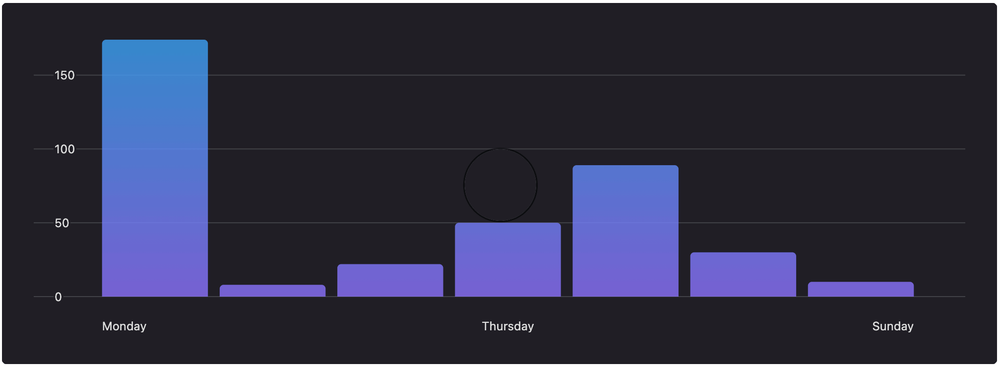

# Bar chart

Used to show comparison across categories.

## Example



```tsx
const data = [
  {rawValue: 324.19, label: '2020-01-01T12:00:00Z'},
  {rawValue: 613.29, label: '2020-01-02T12:00:00Z'},
  {rawValue: 422.79, label: '2020-01-03T12:00:00Z'},
  {
    rawValue: 25.6,
    label: '2020-01-04T12:00:00Z',
  },
  {rawValue: 277.69, label: '2020-01-05T12:00:00Z'},
  {rawValue: 421.19, label: '2020-01-06T12:00:00Z'},
];

function formatXAxisLabel(value: string) {
  return new Date(value).toLocaleDateString('en-CA', {
    day: 'numeric',
    month: 'short',
  });
}

function formatYAxisLabel(value: number) {
  return new Intl.NumberFormat('en-CA', {
    style: 'currency',
    currency: 'CAD',
    maximumSignificantDigits: 2,
  }).format(value);
}

function renderTooltipContent({label, value}: {label: string; value: number}) {
  function formatTooltipLabel(value: string) {
    return new Date(value).toLocaleDateString('en-CA', {
      day: 'numeric',
      month: 'long',
      year: 'numeric',
    });
  }

  function formatTooltipValue(value: number) {
    return new Intl.NumberFormat('en-CA', {
      style: 'currency',
      currency: 'CAD',
    }).format(value);
  }

  const formattedLabel = formatTooltipLabel(label);
  const formattedValue = formatTooltipValue(value);

  return (
    <BarChartTooltipContent label={formattedLabel} value={formattedValue} />
  );
}

return (
  <BarChart
    data={data}
    color="primary"
    formatXAxisLabel={formatXAxisLabel}
    formatYAxisLabel={formatYAxisLabel}
    renderTooltipContent={renderTooltipContent}
    skipLinkText="Skip chart content"
  />
);
```

## Usage

The bar chart interface looks like this:

```typescript
interface BarChartProps {
  data: {rawValue: number; label: string}[];
  barMargin?: 'Small' | 'Medium' | 'Large' | 'None';
  color?: Color;
  formatXAxisLabel?(value: string, index?: number, data?: string[]): string;
  formatYAxisLabel?(value: number): string;
  renderTooltipContent?({
    label,
    value,
  }: {
    lable: string;
    value: string;
  }): React.ReactNode;
  highlightColor?: Color;
  timeSeries?: boolean;
  skipLinkText?: string;
  emptyStateText?: string;
}
```

In order for the user to have visual feedback that a bar has been selected, it is recommended that a `highlightColor`, which is different to the `color`, is passed in for this component. If a `highlightColor` is not provided, the browser's default outline treatment will be used when the bar is focused.

### Required props

#### data

| type                                  |
| ------------------------------------- |
| `{rawValue: number, label: string}[]` |

The array of objects that the chart uses to draw the chart.
If `data` may be an empty array, provide <a href="#emptyStateText">`emptyStateText`</a> to communicate the empty state to screenreaders.

### Optional props

#### accessibilityLabel

| type     | default     |
| -------- | ----------- |
| `string` | `undefined` |

Visually hidden text for screen readers.

#### barMargin

| type                                       | default  |
| ------------------------------------------ | -------- |
| `'Small' \| 'Medium' \| 'Large' \| 'None'` | `Medium` |

This sets the margin between each of the bars. A value of `None` will make the bars look as if they are one continuous element.

#### color

| type    | default   |
| ------- | --------- |
| `Color` | `primary` |

The bar fill color. This accepts any [Polaris Viz accepted color](/documentation/Polaris-Viz-colors.md).

#### formatXAxisLabel

| type                                                        | default                       |
| ----------------------------------------------------------- | ----------------------------- |
| `(value: string, index?: number, data?: string[]): string;` | `(value) => value.toString()` |

This accepts a function that is called to format the labels when the chart draws its X axis.

#### formatYAxisLabel

| type                      | default                       |
| ------------------------- | ----------------------------- |
| `(value: number): string` | `(value) => value.toString()` |

This accepts a function that is called when the Y value (`rawValue`) is formatted for the tooltip and for the Y Axis.

#### renderTooltipContent

| type                                                                 |
| -------------------------------------------------------------------- |
| `({label, value}: {label: string; value: number}): React.ReactNode;` |

This accepts a function that is called to render the tooltip content. By default it calls `formatXAxisLabel` and `formatYAxisLabel` to format the the tooltip values and passes them to `<BarChartTooltipContent />`. For more information about tooltip content, read the [tooltip content documentation](/src/components/TooltipContent/TooltipContent.md).

#### highlightColor

| type    | default   |
| ------- | --------- |
| `Color` | `primary` |

The bar fill color when you hover over a bar in the chart. This accepts any [Polaris Viz accepted color](/documentation/Polaris-Viz-colors.md).

#### timeSeries

| type      | default |
| --------- | ------- |
| `boolean` | `false` |

This indicates to the chart if the data provide is time series data. If `true`, the x-axis will display fewer labels as needed according to the data.

#### hasRoundedCorners

| type      | default |
| --------- | ------- |
| `boolean` | `false` |

Rounds the top corners of each bar, in the case of positive numbers. Rounds the bottom corners for negatives.

#### emptyStateText

| type     | default     |
| -------- | ----------- |
| `string` | `undefined` |

Used to indicate to screenreaders that a chart with no data has been rendered, in the case that an empty array is passed as the data. It is strongly recommended that this is included if the data prop could be an empty array.
