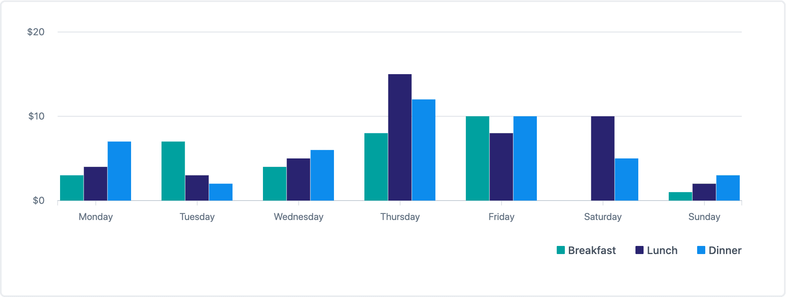

# Grouped bar chart

Used to show comparison of different types, across categories.

## Example



```tsx
const series = [
  {
    color: 'primary',
    label: 'Breakfast',
    data: [3, 7, 4, 8, 10, 0, 1],
  },
  {
    color: 'secondary',
    label: 'Lunch',
    data: [4, 3, 5, 15, 8, 10, 2],
  },
  {
    color: 'tertiary',
    label: 'Dinner',
    data: [7, 2, 6, 12, 10, 5, 3],
  },
];

const labels = [
  'Monday',
  'Tuesday',
  'Wednesday',
  'Thursday',
  'Friday',
  'Saturday',
  'Sunday',
];

const formatYValue = (val: number) =>
  new Intl.NumberFormat('en-CA', {
    style: 'currency',
    currency: 'CAD',
    maximumSignificantDigits: 3,
  }).format(val);

return (
  <GroupedBarChart
    formatYValue={formatYValue}
    labels={labels}
    series={series}
  />
);
```

## Usage

The grouped bar chart interface looks like this:

```typescript
{
  series: Data[];
  labels: string[];
  accessibilityLabel?: string;
  chartHeight?: number;
  formatYValue?(value: number): string;
  timeSeries?: boolean;
}
```

This component derives its size from its parent container and fills the width of its parent's container. It has a default height of `250`, which is configurable via the `chartHeight` prop. The `chartHeight` specifically affects the height of chart, and does not include or affect the height of the legend.

### Required props

#### series

| type                                              |
| ------------------------------------------------- |
| `{data: number[], color: Color, label: string}[]` |

The data prop to determine the chart's drawn area. Each series object contains a `data` array, which contains all of the values for that given group. The `color` attribute accepts any [Polaris Viz color](documentation/Polaris-Viz-colors.md). The `label` attribute gives a name to each series (or group) of data.

#### labels

| type       |
| ---------- |
| `string[]` |

The labels for the x-axis of the chart. This array should be equal in length to each of the `data` arrays in the `series` prop.

### Optional props

#### accessibilityLabel

| type     | default      |
| -------- | ------------ |
| `string` | empty string |

Visually hidden text for screen readers.

#### chartHeight

| type     | default |
| -------- | ------- |
| `number` | `250`   |

Determines the height of the chart.

#### formatYValue

| type                       | default                     |
| -------------------------- | --------------------------- |
| `(value: number): string;` | `` (value) => `${value}` `` |

This utility function is called for every y axis value when the chart is drawn.

#### timeSeries

| type      | default |
| --------- | ------- |
| `boolean` | `false` |

This indicates to the chart if the data provide is time series data. If `true`, the x-axis will display fewer labels as needed according to the data.
