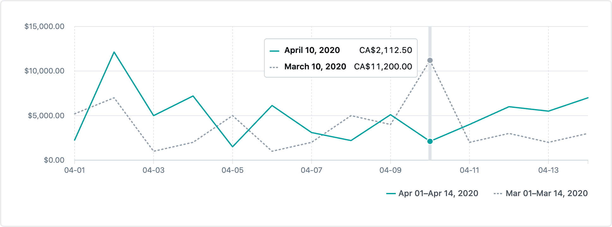

# Line chart

Used to show change over time, comparisons, and trends.

It's reccomended that you use a legend whenever displaying multiseries data. To display one, use the <a href="../Legend/Legend.md">`<Legend />` component</a>.

## Example



```tsx
const series = [
  {
    name: 'Apr 01–Apr 14, 2020',
    data: [
      {rawValue: 2251, label: '2020-04-01T12:00:00'},
      {rawValue: 12132.2, label: '2020-04-02T12:00:00'},
      {rawValue: 5000, label: '2020-04-03T12:00:00'},
      {rawValue: 7200, label: '2020-04-04T12:00:00'},
      {rawValue: 1500, label: '2020-04-05T12:00:00'},
      {rawValue: 6132, label: '2020-04-06T12:00:00'},
      {rawValue: 3100, label: '2020-04-07T12:00:00'},
      {rawValue: 2200, label: '2020-04-08T12:00:00'},
      {rawValue: 5103, label: '2020-04-09T12:00:00'},
      {rawValue: 2112.5, label: '2020-04-10T12:00:00'},
      {rawValue: 4004, label: '2020-04-11T12:00:00'},
      {rawValue: 6000, label: '2020-04-12T12:00:00'},
      {rawValue: 5500, label: '2020-04-13T12:00:00'},
      {rawValue: 7000, label: '2020-04-14T12:00:00'},
    ],
    color: 'primary',
  },
  {
    name: 'Mar 01–Mar 14, 2020',
    data: [
      {rawValue: 5200, label: '2020-03-01T12:00:00'},
      {rawValue: 7000, label: '2020-03-02T12:00:00'},
      {rawValue: 1000, label: '2020-03-03T12:00:00'},
      {rawValue: 2000, label: '2020-03-04T12:00:00'},
      {rawValue: 5000, label: '2020-03-05T12:00:00'},
      {rawValue: 1000, label: '2020-03-06T12:00:00'},
      {rawValue: 2000, label: '2020-03-07T12:00:00'},
      {rawValue: 5000, label: '2020-03-08T12:00:00'},
      {rawValue: 4000, label: '2020-03-09T12:00:00'},
      {rawValue: 11200, label: '2020-03-10T12:00:00'},
      {rawValue: 2000, label: '2020-03-11T12:00:00'},
      {rawValue: 3000, label: '2020-03-12T12:00:00'},
      {rawValue: 2000, label: '2020-03-13T12:00:00'},
      {rawValue: 3000, label: '2020-03-14T12:00:00'},
    ],
    color: 'pastComparison',
    lineStyle: 'dashed' as 'dashed',
  },
];

const xAxisLabels = series[0].data.map(({label}) => label);

function formatXAxisLabel(value: string) {
  return new Date(value).toLocaleDateString('en-CA', {
    day: 'numeric',
    month: 'numeric',
  });
}

function formatYAxisLabel(value: number) {
  return new Intl.NumberFormat('en', {
    style: 'currency',
    currency: 'CAD',
    currencyDisplay: 'symbol',
    maximumSignificantDigits: 1,
  }).format(value);
}

const renderTooltipContent: LineChartProps['renderTooltipContent'] = ({
  data,
}) => {
  function formatTooltipValue(value: number) {
    return new Intl.NumberFormat('en', {
      style: 'currency',
      currency: 'CAD',
    }).format(value);
  }

  function formatTooltipLabel(value: string) {
    return new Date(value).toLocaleDateString('en-CA', {
      day: 'numeric',
      month: 'long',
      year: 'numeric',
    });
  }

  const formattedData = data.map(({name, point: {label, value}, style}) => ({
    name,
    style,
    point: {
      value: formatTooltipValue(value),
      label: formatTooltipLabel(label),
    },
  }));

  return <LineChartTooltipContent data={formattedData} />;
};

return (
  <LineChart
    series={series}
    xAxisLabels={xAxisLabels}
    formatXAxisLabel={formatXAxisLabel}
    formatYAxisLabel={formatYAxisLabel}
    renderTooltipContent={renderTooltipContent}
    skipLinkText="Skip chart content"
  />
);
```

## Usage

The line chart interface looks like this:

```typescript
interface LineChartProps {
  series: Series[];
  xAxisLabels: string[];
  formatXAxisLabel?(value: string, index?: number, data?: string[]): string;
  formatYAxisLabel?(value: number): string;
  renderTooltipContent?: (data: RenderTooltipContentData): React.ReactNode;
  skipLinkText?: string;
  hideXAxisLabels?: boolean;
}
```

This component derives its size from its parent container and fills the width of its parent's container.

### The `Series` type

The `Series` type gives the user a lot of flexibility to define exactly what each series/line should look like. Its interface looks like this:

```typescript
{
  name: string;
  data: {
    label: string;
    rawValue: number;
  }[];
  color?: Color;
  lineStyle?: LineStyle;
  showArea?: boolean;
}
```

#### name

| type     |
| -------- |
| `string` |

The name of the series.

#### data

| type                                  |
| ------------------------------------- |
| `{label: string, rawValue: number}[]` |

The array of objects that the chart uses to plot the line.

#### color

| type    | default   |
| ------- | --------- |
| `Color` | `primary` |

This accepts any [Polaris Viz color](/documentation/Polaris-Viz-colors.md) value.

#### lineStyle

| type                  | default   |
| --------------------- | --------- |
| `'solid' \| 'dashed'` | `'solid'` |

The lineStyle type determines if the drawn line for the series is a solid or dashed line.

#### showArea

| type      | default |
| --------- | ------- |
| `boolean` | `false` |

The showArea type determines if a gradient area style is used for the series.

### The `RenderTooltipContentData` type

The `RenderTooltipContentData` type looks very similar to the `Series` type. Its interface looks like this:

```tsx
interface RenderTooltipContentData {
  data: {
    name: string;
    point: {
      label: string;
      value: number;
    };
    style?: {
      color?: Color;
      lineStyle?: LineStyle;
    };
  }[];
}
```

The distinction between the `RenderTooltipContentData` and `Series` types is that `RenderTooltipContentData` is for a single data point, instead of an entire series of data.

### Required props

#### series

| type       |
| ---------- |
| `Series[]` |

The prop to determine the chart's drawn area. Each `Series` object corresponds to a line drawn on the chart, and is explained in greater detail above.

#### xAxisLabels

| type       | default |
| ---------- | ------- |
| `string[]` | `[]`    |

The labels to display on the x axis of the chart and in a data table used for screenreaders.

### Optional props

Determines the height of the chart.

#### hideXAxisLabels

| type      | default |
| --------- | ------- |
| `boolean` | false   |

Whether to visually hide the x axis labels on the chart. The labels will still be displayed to screenreaders.

#### formatXAxisLabel

| type                                                        | default                       |
| ----------------------------------------------------------- | ----------------------------- |
| `(value: string, index?: number, data?: string[]): string;` | `(value) => value.toString()` |

This accepts a function that is called to format the labels when the chart draws its X axis.

#### formatYAxisLabel

| type                       | default                       |
| -------------------------- | ----------------------------- |
| `(value: number): string;` | `(value) => value.toString()` |

This utilty function is called to format the labels for every y axis value when the chart is laid out.

#### renderTooltipContent

| type                                                 |
| ---------------------------------------------------- |
| `(data: RenderTooltipContentData): React.ReactNode;` |

This accepts a function that is called to render the tooltip content. By default it calls `formatXAxisLabel` and `formatYAxisLabel` to format the the tooltip values and passes them to `<LineChartTooltipContent />`. For more information about tooltip content, read the [tooltip content documentation](/src/components/TooltipContent/TooltipContent.md).

#### skipLinkText

| type     |
| -------- |
| `string` |

If provided, renders a `<SkipLink/>` button with the string. Use this for charts with large data sets, so keyboard users can skip all the tabbable data points in the chart.

#### hasSpline

| type      | default |
| --------- | ------- |
| `boolean` | `false` |

Whether to curve the line between points.

#### isAnimated

| type      | default |
| --------- | ------- |
| `boolean` | `false` |

Whether to animate the chart when it is initially rendered and its data is updated. Even if `isAnimated` is set to true, animations will not be displayed for users with reduced motion preferences.
