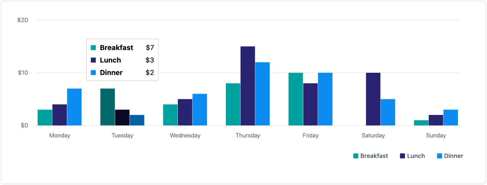
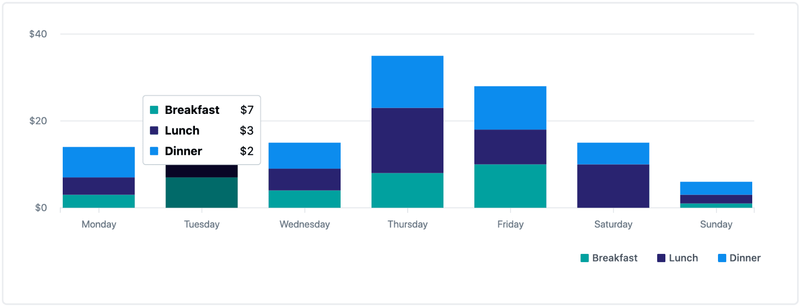

# Multi-series bar chart

Used to show comparison of different types, across categories.

## Example

| Grouped                                                                                  | Stacked                                                                                  |
| ---------------------------------------------------------------------------------------- | ---------------------------------------------------------------------------------------- |
|  |  |

```tsx
const series = [
  {
    name: 'Breakfast',
    color: 'primary',
    highlightColor: 'primaryProminent',
    data: [
      {label: 'Monday', rawValue: 3},
      {label: 'Tuesday', rawValue: 7},
      {label: 'Wednesday', rawValue: 4},
      {label: 'Thursday', rawValue: 8},
      {label: 'Friday', rawValue: 10},
      {label: 'Saturday', rawValue: 0},
      {label: 'Sunday', rawValue: 1},
    ],
  },
  {
    name: 'Lunch',
    color: 'secondary',
    highlightColor: 'secondaryProminent',
    data: [
      {label: 'Monday', rawValue: 4},
      {label: 'Tuesday', rawValue: 3},
      {label: 'Wednesday', rawValue: 5},
      {label: 'Thursday', rawValue: 15},
      {label: 'Friday', rawValue: 8},
      {label: 'Saturday', rawValue: 10},
      {label: 'Sunday', rawValue: 2},
    ],
  },
  {
    name: 'Dinner',
    color: 'tertiary',
    highlightColor: 'tertiaryProminent',
    data: [
      {label: 'Monday', rawValue: 7},
      {label: 'Tuesday', rawValue: 2},
      {label: 'Wednesday', rawValue: 6},
      {label: 'Thursday', rawValue: 12},
      {label: 'Friday', rawValue: 10},
      {label: 'Saturday', rawValue: 5},
      {label: 'Sunday', rawValue: 3},
    ],
  },
];

const labels = [
  'Monday',
  'Tuesday',
  'Wednesday',
  'Thursday',
  'Friday',
  'Saturday',
  'Sunday',
];

const formatYAxisLabel = (val: number) =>
  new Intl.NumberFormat('en-CA', {
    style: 'currency',
    currency: 'CAD',
    maximumSignificantDigits: 3,
  }).format(val);

const renderTooltipContent: MultiSeriesBarChartProps['renderTooltipContent'] = ({
  data,
  title,
}) => {
  const formatTooltipValue = (val: number) =>
    new Intl.NumberFormat('en-CA', {
      style: 'currency',
      currency: 'CAD',
    }).format(val);

  const formattedData = data.map(({label, value, color}) => ({
    color,
    label,
    value: formatTooltipValue(value),
  }));

  const total = data.reduce((totalValue, {value}) => totalValue + value, 0);

  return (
    <TooltipContent
      title={title}
      data={formattedData}
      total={{label: 'Total', value: formatTooltipValue(total)}}
    />
  );
};

return (
  <MultiSeriesBarChart
    yAxisOptions={{labelFormatter: formatYAxisLabel}}
    xAxisOptions={{labels}}
    barOptions={{isStacked}}
    series={series}
    renderTooltipContent={renderTooltipContent}
    skipLinkText="Skip chart content"
  />
);
```

## Usage

The multi-series bar chart interface looks like this:

```typescript
interface MultiSeriesBarChartProps {
  series: Series[];
  renderTooltipContent?: (data: RenderTooltipContentData): React.ReactNode;
  skipLinkText?: string;
  emptyStateText?: string;
  barOptions?: {
    isStacked?: boolean;
    hasRoundedCorners?: boolean;
  };
  gridOptions?: {
    showHorizontalLines?: boolean;
    color?: string;
  };
  xAxisOptions: {
    labelFormatter?(value: string, index?: number, data?: string[]): string;
    showTicks?: boolean;
    labels: string[];
    labelColor: string;
  };
  yAxisOptions: {
    labelFormatter?(value: number): string;
    labelColor?: string;
    labelBackgroundColor?: string;
  };
}
```

This component derives its size from its parent container and fills the width of its parent's container.

### The `Series` type

#### series

The `Series` type gives the user a lot of flexibility to define exactly what each bar group should look like. Its interface looks like this:

```typescript
{
  name: string;
  data: {
    label: string;
    rawValue: number;
  }[];
  color?: Color;
  highlightColor?: Color;
}
```

If `series` may be an empty array, provide <a href="#emptyStateText">`emptyStateText`</a> to communicate the empty state to screenreaders.

#### name

| type     |
| -------- |
| `string` |

The name of the series/group.

#### data

| type                                  |
| ------------------------------------- |
| `{label: string, rawValue: number}[]` |

The array of objects that the chart uses to draw the groups.

#### color

| type    | default     |
| ------- | ----------- |
| `Color` | `'primary'` |

This accepts any [Polaris Viz color](/documentation/Polaris-Viz-colors.md) value, and corresponds to the color of the bar for that series.

#### highlightColor

| type    | default     |
| ------- | ----------- |
| `Color` | `'primary'` |

This accepts any [Polaris Viz color](/documentation/Polaris-Viz-colors.md) value, and corresponds to the color of the bar for that series when you hover over a bar group. It defaults to `primary`. The four 'prominent' Polaris Viz colors (`primaryProminent`, `secondaryProminent`, `tertiaryProminent`, `quaternaryProminent`) exist as a good option for a complimentary hover color.

In order for the user to have visual feedback that a bar has been selected, it is recommended that a `highlightColor`, which is different to the `color`, is passed in in the `series` for this component. If a `highlightColor` is not provided, the browser's default outline treatment will be used when the bar is focused.

### The `RenderTooltipContentData` type

The `RenderTooltipContentData` type looks very similar to the `Series` type. Its interface looks like this:

```tsx
interface RenderTooltipContentData {
  data: {
    color: Color;
    label: string;
    value: number;
  }[];
  title: string;
}
```

The distinction between the `RenderTooltipContentData` and series `Data` types is that `RenderTooltipContentData` is for a single data point, instead of an entire series of data.

### Required props

#### series

| type       |
| ---------- |
| `Series[]` |

The prop to determine the chart's drawn area. Each `Series` object corresponds to a group drawn on the chart, and is explained in greater detail [above](#the-series-type).

#### xAxisOptions: labels

| type       |
| ---------- |
| `string[]` |

The labels for the x-axis of the chart. This array should be equal in length to each of the `data` arrays in the `series` prop.

### Optional props

#### isAnimated

| type      | default |
| --------- | ------- |
| `boolean` | `false` |

Whether to animate the bars when the chart is initially rendered and its data is updated. Even if `isAnimated` is set to true, animations will not be displayed for users with reduced motion preferences. Note: animations are currently only available for the non-stacked bar chart.

#### skipLinkText

| type     |
| -------- |
| `string` |

If provided, renders a `<SkipLink/>` button with the string. Use this for charts with large data sets, so keyboard users can skip all the tabbable data points in the chart.

#### renderTooltipContent

| type                                                 |
| ---------------------------------------------------- |
| `(data: RenderTooltipContentData): React.ReactNode;` |

This accepts a function that is called to render the tooltip content. By default it calls `formatYAxisLabel` to format the the tooltip value and passes it to `<TooltipContent />`. For more information about tooltip content, read the [tooltip content documentation](/src/components/TooltipContent/TooltipContent.md).

#### xAxisOptions

An object including the following proprties that define the appearance of the xAxis. Only labels is mandatory.

##### labelFormatter

| type                                                        | default                       |
| ----------------------------------------------------------- | ----------------------------- |
| `(value: string, index?: number, data?: string[]): string;` | `(value) => value.toString()` |

This accepts a function that is called to format the labels when the chart draws its X axis.

It's reccomended that you use a legend whenever displaying multiseries data. To display one, use the <a href="../Legend/Legend.md">`<Legend />` component</a>.

##### showTicks

| type      | default |
| --------- | ------- |
| `boolean` | true    |

Whether to show ticks connecting the xAxis labels to their corresponding grid line.

##### labelColor

| type     | default                |
| -------- | ---------------------- |
| `string` | `'rgb(223, 227, 232)'` |

The color used for axis labels.

#### yAxisOptions

##### labelFormatter

| type                       | default                       |
| -------------------------- | ----------------------------- |
| `(value: number): string;` | `(value) => value.toString()` |

This utility function is called for every y axis value when the chart is drawn.

##### labelColor

| type     | default                |
| -------- | ---------------------- |
| `string` | `'rgb(223, 227, 232)'` |

The color used for axis labels.

##### labelBackgroundColor

| type                 | default     |
| -------------------- | ----------- |
| `string | undefined` | `undefined` |

The color used for label backgrounds. This accepts any [valid CSS color](https://developer.mozilla.org/en-US/docs/Web/CSS/color). If none is specified, the labels will not have a background.

#### barOptions

##### isStacked

| type      | default |
| --------- | ------- |
| `boolean` | `false` |

This changes the grouping of the bars. If `true` the bar groups will stack vertically, otherwise they will render individual bars for each data point in each group. To see an example of stacked vs. grouped orientations, refer to the images above.

##### hasRoundedCorners

| type      | default |
| --------- | ------- |
| `boolean` | `false` |

Rounds the top corners of each bar, in the case of positive numbers. Rounds the bottom corners for negatives. Note: this prop only has an impact on grouped bars, not stacked ones.

#### gridOptions

An object including the following optional proprties that define the grid.

##### showVHorizontalLines

| type      | default |
| --------- | ------- |
| `boolean` | `true`  |

Whether to show lines extending from the yAxis labels through the chart.

##### color

| type     | default                |
| -------- | ---------------------- |
| `string` | `"rgb(223, 227, 232)"` |

The color of the grid lines.

#### emptyStateText

| type     | default     |
| -------- | ----------- |
| `string` | `undefined` |

Used to indicate to screenreaders that a chart with no series data has been rendered, in the case that an empty array is passed as the data. It is strongly recommended that this is included if the series prop could be an empty array.
