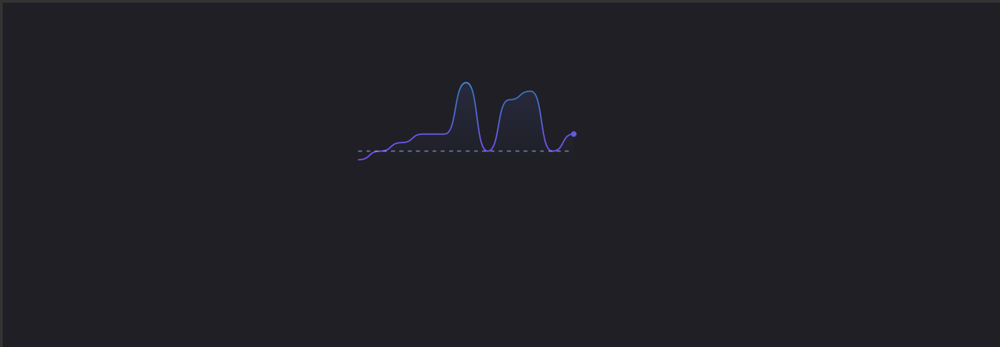

# Sparkline

Used in small sizes to give an overview of how a metric has performed over time.

## Example



```tsx
const props = {
  accessibilityLabel: 'Customer growth over time',
  isAnimated: true,
  series: [
    {
      data: [
        {y: null, x: 0},
        {y: null, x: 1},
        {y: null, x: 2},
        {y: null, x: 3},
        {y: null, x: 4},
        {y: null, x: 5},
        {y: null, x: 6},
        {y: 9, x: 7},
        {y: 7, x: 8},
        {y: 3, x: 9},
        {y: 0, x: 10},
        {y: 1, x: 11},
        {y: 1, x: 12},
        {y: 1, x: 13},
        {y: 1, x: 14},
        {y: 1, x: 15},
        {y: 8, x: 16},
        {y: 17, x: 17},
        {y: 15, x: 18},
        {y: 8, x: 19},
        {y: 1, x: 20},
        {y: 2, x: 21},
        {y: 2, x: 22},
        {y: 2, x: 23},
      ],
      hasPoint: true,
      color: 'red',
      offsetRight: 12,
    },
    {
      data: [
        {x: 0, y: 7},
        {x: 1, y: 7},
        {x: 2, y: 7},
        {x: 3, y: 7},
        {x: 4, y: 7},
        {x: 5, y: 7},
        {x: 6, y: 7},
        {x: 7, y: 7},
        {x: 8, y: 7},
        {x: 9, y: 7},
        {x: 10, y: 7},
        {x: 11, y: 7},
        {x: 12, y: 7},
        {x: 13, y: 7},
        {x: 14, y: 7},
        {x: 15, y: 7},
        {x: 16, y: 7},
        {x: 17, y: 7},
        {x: 18, y: 7},
        {x: 19, y: 7},
        {x: 20, y: 7},
        {x: 21, y: 7},
        {x: 22, y: 7},
        {x: 23, y: 7},
      ],
      lineStyle: 'dashed',
      color: 'red',
    },
  ],
  hasSpline: true,
  isAnimated: true,
};

return (
  <div style={{width: '200px', height: '50px'}}>
    <Sparkline {...props} />
  </div>
);
```

## Usage

The sparkline interface looks like this:

```typescript
{
  series: {color: string | GradientStop[], area: string | GradientStop[] | null, lineStyle: LineStyle, hasPoint: boolean, data: Coordinates[]}[];
  accessibilityLabel?: string;
  isAnimated?: boolean;
}
```

This component determines its width and height based off its parent element. The typical usage is to wrap this component in a div that has a height/width set, like:

```tsx
<div style={{height: '200px', width: '50px'}}>
  <Sparkline {...props} />
</div>
```

### Required props

#### The series type

| type                                                                                                                                                  |
| ----------------------------------------------------------------------------------------------------------------------------------------------------- |
| `{data: Coordinates[], color?: string, area?: string \| GradientStop[] \| null, lineStyle?: LineStyle, hasPoint?: boolean, offsetLeft?: number; offsetRight?: number}[]` |

The sparkline can show one data series or a set of comparison data series.

##### data

| type                                       |
| ------------------------------------------ |
| `{x: number \| null, y: number \| null}[]` |

The prop to determine the chart's drawn area. If null is provided, the line will not be drawn for that area.

##### color

| type    | default     |
| ------- | ----------- |
| `string` | `"rgb(71, 193, 191)"` |

The sparkline stroke and fill color. This accepts any CSS color.

##### areaFillStyle

| type                      | default |
| ------------------------- | ------- |
| `none \| solid \| gradient` | `none`  |

Determines whether to fill in the area beneath the line and what kind of shading to use.

##### lineStyle

| type             | default |
| ---------------- | ------- |
| `solid \| dashed` | `solid` |

Determines the style of line used for the series.

##### hasPoint

| type      | default |
| --------- | ------- |
| `boolean` | `false` |

Whether to highlight the last data point of the series with a circle.

##### offsetLeft

| type     | default |
| -------- | ------- |
| `number` | `0`     |

The amount of pixels to add as a left margin to the series.

##### offsetRight

| type     | default |
| -------- | ------- |
| `number` | `0`     |

The amount of pixels to add as a right margin to the series.

---

### Optional props

#### accessibilityLabel

| type     | default     |
| -------- | ----------- |
| `string` | `undefined` |

Visually hidden text for screen readers.

#### isAnimated

| type      | default |
| --------- | ------- |
| `boolean` | `false` |

Determines whether to animate the chart on state changes.

#### hasSpline

| type      | default |
| --------- | ------- |
| `boolean` | `false` |

Whether to curve the line between points.
