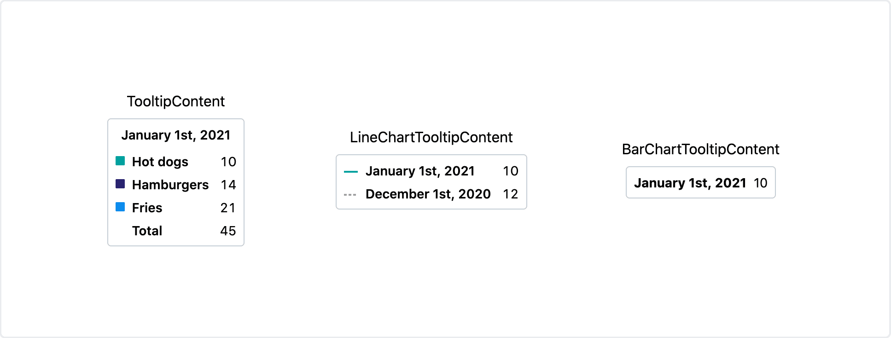

# Tooltip Content

Used to format content within a chart's tooltip.

## Example



```tsx
const tooltipContentData: TooltipContentProps['data'] = [
  {
    color: 'primary',
    label: 'Hot dogs',
    value: '10',
  },
  {
    color: 'secondary',
    label: 'Hamburgers',
    value: '14',
  },

  {
    color: 'tertiary',
    label: 'Fries',
    value: '21',
  },
];

const lineChartTooltipContentData: LineChartTooltipContentProps['data'] = [
  {
    name: 'Hot Dogs',
    point: {
      label: 'January 1st, 2021',
      value: '10',
    },
    style: {
      color: 'primary',
      lineStyle: 'solid',
    },
  },
  {
    name: 'Hot Dogs',
    point: {
      label: 'December 1st, 2020',
      value: '12',
    },
    style: {
      color: 'pastComparison',
      lineStyle: 'dashed',
    },
  },
];

return (
  <div>
    <TooltipContent
      title="January 1st, 2021"
      data={tooltipContentData}
      total={{
        label: 'Total',
        value: '45',
      }}
    />

    <LineChartTooltipContent data={lineChartTooltipContentData} />

    <BarChartTooltipContent label="January 1st, 2021" value="10" />
  </div>
);
```

## Usage

Polaris Viz charts have `renderTooltipContent` callbacks in order to customize the content displayed inside of a tooltip. You can use `<TooltipContent />`, `<LineChartTooltipContent />`, and `<BarChartTooltipContent />` to make organizing your content easier.

No formatting will be applied in any case to values passed to tooltip content components. They expect pre-formatted values.

**Note:** These components are meant to be used with the `renderTooltipContent` callback.

### TooltipContent

The props interface for `<TooltipContent />` looks like this:

```typescript
{
  title?: string;
  data: {
    color: Color;
    label: string;
    value: string;
  }[];
  total?: null | {
    label: string;
    value: string;
  };
}
```

You can access this interface by importing `TooltipContentProps`.

#### Required props

##### data

| type                                            |
| ----------------------------------------------- |
| `{color:Color; label: string; value: number}[]` |

Each member of the `data` array corresponds to a row in the `<TooltipContent />` object. The value for `color` corresponds to the fill color for the square preview, and accepts any [Polaris Viz accepted color](/documentation/Polaris-Viz-colors.md).

#### Optional props

##### title

| type     | default     |
| -------- | ----------- |
| `string` | `undefined` |

The title to display at the top of the tooltip.

##### total

| type                                    | default     |
| --------------------------------------- | ----------- |
| `{label: string; value: string} | null` | `undefined` |

This allows you to add a total row at the bottom of all the data rows.

### LineChartTooltipContent

The props interface for `<LineChartTooltipContent />` looks like this:

```typescript
{
  data: {
    name: string;
    point: {
      label: string;
      value: string;
    };
    style?: {
      color?: Color;
      lineStyle?: LineStyle;
    };
  }[];
}
```

You can access this interface by importing `LineChartTooltipContentProps`. This is meant to be used alongside `<LineChart />`.

#### Required props

##### name

| type     |
| -------- |
| `string` |

The name associated with the data point's series

##### point

| type                             |
| -------------------------------- |
| `{label: string; value: number}` |

The values to display for the given data point.

#### Optional props

##### style

| type                                     | default     |
| ---------------------------------------- | ----------- |
| `{color?: Color; lineStyle?: LineStyle}` | `undefined` |

This sets the style for the line drawn next to the point label. `color` accepts any [Polaris Viz accepted color](/documentation/Polaris-Viz-colors.md) and defaults to `colorPurple`. `lineStyle` accepts `solid` and `dashed`, and defaults to `solid`.

### BarChartTooltipContent

The props interface for `<BarChartTooltipContent />` looks like this:

```typescript
{
  label: string;
  value: string;
}
```

You can access this interface by importing `BarChartTooltipContentProps`. This is meant to be used alongside `<BarChart />`.

#### Required props

##### label

| type     |
| -------- |
| `string` |

The label to display on the tooltip.

##### value

| type     |
| -------- |
| `string` |

The value to display on the tooltip.
